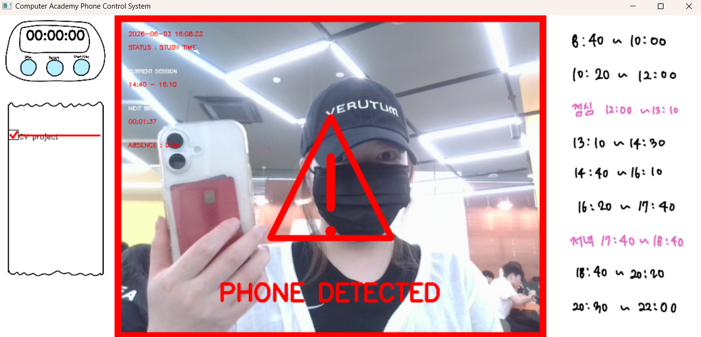
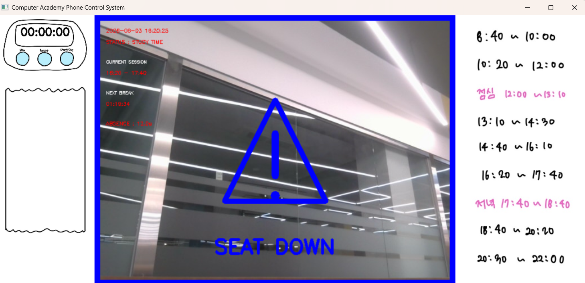
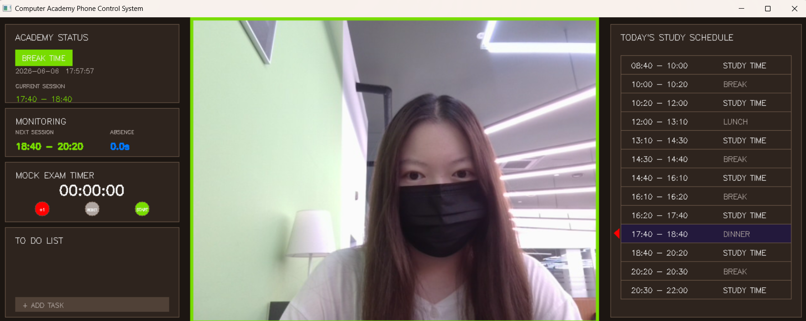
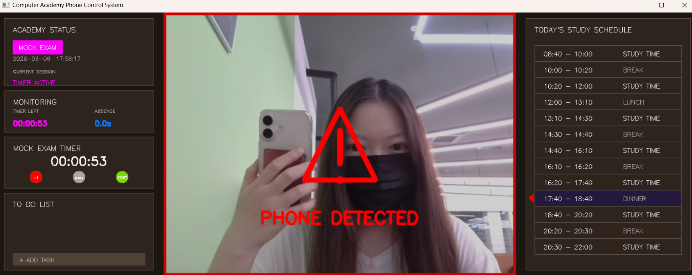
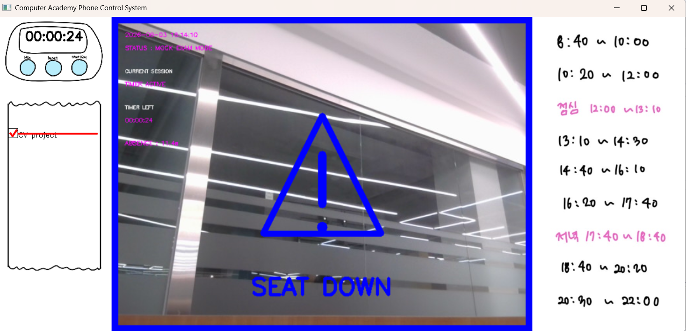

# 컴퓨터 속 재수학원

## 프로젝트 소개
나는 재수와 편입을 경험하며 "디지털 재수학원"이 있으면 좋겠다고 느꼈다.

본 프로젝트는 YOLOv8 객체 탐기술을 활용하여 사용자의 학습 상태를 실시간으로 관리하는 "AI 기반 디지털 재수학원"을 구현하였다.

웹캠 영상을 이용하여 스마트폰 사용 여부와 자리 이탈 여부를 감지하며, 재수학원 시간표를 기반으로 학습 시간과 쉬는 시간을 자동으로 구분한다.

또한 모의고사를 위한 타이머 기능과 To Do List 기능을 제공하여 실제 재수학원 환경을 컴퓨터 안에서 구현하였다.

프로젝트의 목표로는 사용자의 자기주도 학습을 돕는 것이다.

---

## 데이터셋을 학습한 방법
YOLOv8 객체 탐지 모델의 fine-tuning을 위해
kaggle의 cell phone object detection dataset을 활용하였다.
- https://www.kaggle.com/datasets/a165079/cellphoneobjectdetectionusingyolov7
- 위 데이터는 손에 들린 스마트폰, 테이블 위 스마트폰처럼 다양한 각도에서 찍힌 스마트폰 사진들이다. 

총 515장의 train 이미지를 이용하여 모델을 학습하였으며, 
학습 경과 생성된 모델 파일이 best.pt 파일이다.

---

## 프로젝트 기능
- 웹캠 기반 실시간 스마트폰 탐지
- Custom YOLOv8 Fine-tuning
- 스마트폰 위치에 박스 표시
- 경고용 빨간 화면 테두리 출력
- 중앙 경고 아이콘 표시

---

## 사용 기술
- Python
- YOLOv8: 사람 탐지를 위해 사용되었다. 스마트폰 탐지 성능 향상을 위해 데이터셋을 이용하여 YOLOv8 모델을 추가로 학습시켰다. 
- OpenCV
- Ultralytics
- Numpy

---

## 주요 기능
### 1. 스마트폰 탐지
웹캠 영상을 실시간으로 분석하여 스마트폰 사용 여부를 감지한다.
학습 시간/모의고사 타이머 작동 중 스마트폰이 감지되면 PHONE DETECTED 메시지가 표시된다.

### 2. 자리 이탈 감지
YOLOv8 기본 모델을 이용하여 사용자의 존재 여부를 확인한다.
학습 시간/모의고사 타이머 작동 중 10초 이상 화면에서 사라질 경우 SEAT DOWN 메시지가 표시된다.

### 3. 재수학원 시간표 시스템
현재 한국 시간을 기준으로 학습 시간과 쉬는 시간을 판별한다.
아래 학습 시간을 제외한 시간에는 초록색 테두리가 표시되며 스마트폰 사용과 자리 이탈을 금지하지 않는다.

학습시간
- 08:40 ~ 10:00
- 10:20 ~ 12:00
- 13:10 ~ 14:30
- 14:40 ~ 16~10
- 16:20 ~ 17:40
- 18:40 ~ 20:20
- 20:30 ~ 22:00

### 4. 모의고사 타이머
모의고사 시간을 직접 설정할 수 있다.
타이머가 작동하는 동안에는 현재 시간이 쉬는 시간이더라도 스마트폰 사용, 자리 이탈이 계속 감지되며 경고 메시지를 보낸다.

타이머 기능:
- 1분 추가
- 타이머 초기화
- 시작 / 정지

### 5. To Do List
공부해야 할 내용을 To Do List에 추가할 수 있다.
체크박스를 선택 하면 빨간 취소선이 표시된다.
